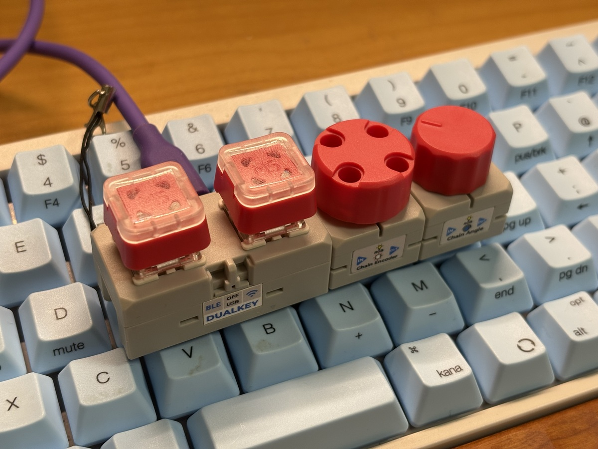

# M5DUALKEY-DeskConsole

🇯🇵 **日本語:** [README.ja.md](README.ja.md)

<p align="center">
  
</p>

A compact USB HID desktop controller built with M5Stack Chain modules for macOS.

Instead of implementing operating-system-specific functions in firmware, this project sends standard USB HID events and delegates application-specific actions to tools such as Raycast.

---

## Features

- Audio output device selection
- Audio output toggle
- Hardware volume control
- Hardware mute
- Hands-free auto scrolling
- Automatic Angle center calibration

---

## Hardware

- M5Stack Chain DualKey (ESP32-S3)
- M5Stack Chain Encoder
- M5Stack Chain Angle

Current layout:

```text
+-----------+-----------+-----------+
| DualKey   | Encoder   | Angle     |
+-----------+-----------+-----------+
```

---

## Controls

| Module | Operation | Function |
|---------|-----------|----------|
| DualKey | Left key | Send `Ctrl + Cmd + 1` |
| DualKey | Right key | Send `Ctrl + Cmd + 2` |
| DualKey | Both keys | Send `Ctrl + Option + S` |
| Encoder | Clockwise | Volume Up |
| Encoder | Counter-clockwise | Volume Down |
| Encoder | Press | Mute / Unmute |
| Angle | Rotate Left | Auto-scroll Up |
| Angle | Center | Stop scrolling |
| Angle | Rotate Right | Auto-scroll Down |

---

## Software Architecture

The firmware itself does **not** directly switch audio devices.

Instead, it sends keyboard shortcuts via USB HID.

```text
M5DUALKEY-DeskConsole
          │
          ▼
      USB HID
          │
          ▼
      macOS
          │
          ▼
      Raycast
          │
          ▼
 AppleScript / Shell Script
          │
          ▼
 Audio Output Switching
```

This design keeps the firmware simple and hardware-focused while allowing the desktop workflow to be customized without modifying the firmware.

---

## Raycast Integration

The current setup uses the following shortcuts.

| Shortcut | Action |
|----------|--------|
| Ctrl + Cmd + 1 | Switch audio output to ORA4 |
| Ctrl + Cmd + 2 | Switch audio output to Studio Display |
| Ctrl + Option + S | Toggle audio output |
| Consumer Control | Volume Up / Down |
| Consumer Control | Mute |

These shortcuts are mapped to Raycast commands, which execute AppleScript or shell scripts on macOS.

The firmware can also be integrated with other automation tools such as:

- BetterTouchTool
- Keyboard Maestro
- Hammerspoon
- Karabiner-Elements

---

## Auto Scroll

The Chain Angle module behaves like a spring-centered throttle.

- Rotate left to scroll upward.
- Rotate right to scroll downward.
- Return to center to stop.
- Scrolling speed increases smoothly as the knob moves farther from the center.
- The firmware automatically calibrates the center position during startup.

---

## Development Environment

- Arduino IDE
- ESP32 Arduino Core (M5Stack)

Libraries

- M5Unified
- M5Chain
- USB HID

---

## Project Status

Implemented

- ✅ USB HID keyboard
- ✅ USB HID consumer control
- ✅ DualKey support
- ✅ Encoder support
- ✅ Angle auto-scroll
- ✅ Automatic Angle calibration

Planned

- ⏳ RGB LED feedback
- ⏳ BLE HID support

---

## License

This project is licensed under the MIT License.

See [LICENSE](LICENSE) for details.

---

## Maintainer

**omiya-bonsai**

https://github.com/omiya-bonsai
